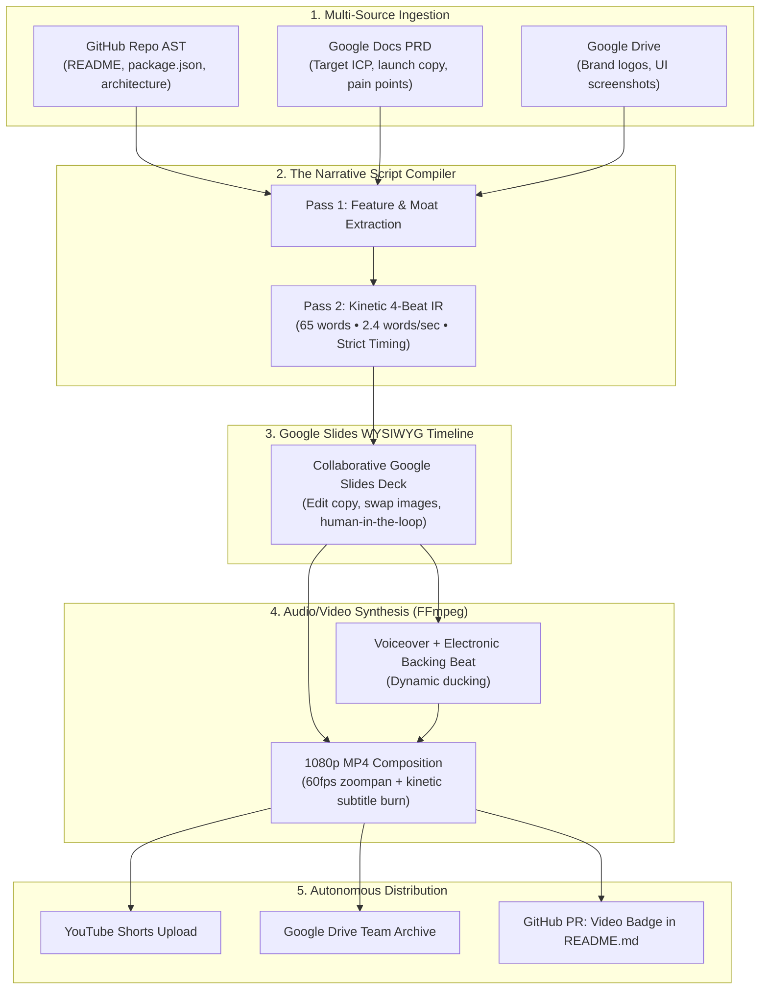

# 🎬 LaunchCast — Autonomous Repo-to-Broadcast Video Engine

[](https://nodejs.org)
[](https://ffmpeg.org)
[](https://workspace.google.com)
[](LICENSE)

> **"Don't just ship code. Broadcast it."**  
> LaunchCast turns entire code repositories and Google Workspace launch briefs into high-converting, 30-second kinetic launch reels in a single command.

## Current implementation boundary

Local rendering is implemented. Google Drive and YouTube uploads are not: their
adapters return `success: false` and `NOT_IMPLEMENTED`, without provider IDs or
public links. The Workspace/AST/Slides descriptions below include planned and
prototype behavior, not verified production integrations. Do not expose the
Web Studio to untrusted users: HTTP authentication, request limits, static-file
containment and origin policy still need a separate hardening pass.

Scanner/render subprocesses use argument arrays, bounded inputs and execution
deadlines. Unattended remote scans accept only public GitHub HTTPS repository
URLs, with ambient Git credentials/configuration disabled. For private or SSH
repositories, clone through your trusted workflow first and pass the local path.
Local metadata reads are bounded; rendering accepts raster media only within
`allowedMediaRoots` (the scanned repository in the full pipeline, otherwise the
working directory). Audio inputs default to the output directory. Text is literal,
not executable FFmpeg filter syntax. Output files cannot replace existing files.
These checks are not an OS sandbox, disk quota, or public multi-tenant boundary.
The single-user Studio keeps a bounded in-memory list of discovered media paths
and passes their scan roots to rendering; rescan after a restart or eviction.
Remote clone checkout bytes and cumulative cache size are not yet quota-limited.

The audio generator produces a **synthetic backing track**, not spoken narration.
It now fails when FFmpeg fails or produces no file. Storyboards must contain 1-8
beats, each 0.1-30 seconds, with a matching total of at most 120 seconds.

`--publish` requests the Google upload path, not Farcaster. `--farcaster` is a
separate explicit request and currently remains blocked because no implemented
upload path supplies an accepted public video. It does not implicitly upload to
Google or change a README. Requested but incomplete distribution exits nonzero
after preserving the local render. A future upload adapter must provide a real
provider ID, matching provider URL, and confirmed `publiclyAccessible: true`;
absent, failed, private, or mismatched results cannot be cast or embedded.

The Neynar adapter reports `ACCEPTED` only for a response with a valid cast hash.
It does not claim independent public verification. Ambiguous outcomes require
reconciliation before retry, and missing credentials are `NOT_CONFIGURED`, not
simulated success. No live posting is exercised by the tests.

Run the offline regression suite with `npm test` (Node.js built-in test runner).
For an opt-in, real local FFmpeg/ffprobe check with synthetic inputs, run
`node test/render-canary.mjs <existing-evidence-directory>`. It retains two
one-second MP4s and audio in a uniquely named subdirectory; it never publishes.

---

## 💡 The Core Problem

- **90% of software projects launch to silence:** Developers spend weeks perfecting their code, but struggle to produce video trailers for Twitter, YouTube Shorts, and Product Hunt.
- **Video editing takes 4+ hours:** Dragging clips in Premiere or CapCut, timing kinetic subtitles, and finding audio is painful and slow.
- **Black-box AI video fails:** Generic AI video generators don't understand your technical codebase, hallucinate random features, and give you no way to edit the script without re-prompting from scratch.

---

## ⚡ The Next-Level Solution: Google Workspace + Codebase AST

LaunchCast solves this by treating video creation as a **compilation problem**:



---

## 🏆 The 4-Beat 30-Second Formula

Every video is deterministically compiled against a proven retention curve:

| Beat | Window | Purpose | Visual Directive |
|---|---|---|---|
| **Beat 1: The Agony** | `0s – 6s` | Name the painful status quo / friction | Rapid-cut chaos, problem alert |
| **Beat 2: The Mechanism** | `6s – 14s` | Introduce the product and core engine | Smooth camera zoom, hero UI HUD |
| **Beat 3: Technical Proof** | `14s – 22s` | Show live terminal execution or UI features | Feature split, terminal pulse, AST checks |
| **Beat 4: The Climax & CTA** | `22s – 30s` | State why it scales and link the repo | Kinetic GitHub badge, star CTA |

---

## 🚀 Quickstart

### 1. Installation
```bash
git clone https://github.com/BrandonDucar/launchcast.git
cd launchcast
npm install
```

### 2. Generate a 30s Video from any Local Repo or GitHub URL
```bash
# Vertical (9:16 for TikTok, YouTube Shorts, Reels)
node cli.mjs ../my-cool-project

# Landscape (16:9 for YouTube, Twitter/X, GitHub)
node cli.mjs https://github.com/user/my-repo --format landscape

# Export to Google Slides for collaborative team editing
node cli.mjs ../my-cool-project --slides

# Request distribution (currently reports NOT_IMPLEMENTED and exits nonzero)
node cli.mjs ../my-cool-project --publish
```

### 3. Launch the Interactive Web Studio
```bash
node server.mjs
# Open http://localhost:3344 in your browser
```

---

## 🖼️ Why Google Slides is the Secret Weapon

Instead of forcing users to learn a complicated timeline editor or endure black-box re-prompting:
1. LaunchCast compiles the storyboard into a **5-slide Google Slides deck**.
2. **Slide 1-4:** Keyframes, visual directives, and overlay headlines.
3. **Speaker Notes:** Contain the exact voiceover script timed to the second.
4. Anyone on your team can open Google Slides, edit words, swap a screenshot, and hit **"Render"**.
5. The engine pulls the slide adjustments and compiles the final MP4 in seconds.

---

## 🛠️ CLI Reference

```text
Usage:
  launchcast <target> [options]
  launchcast scan <target>
  launchcast compile <target>
  launchcast ui

Options:
  --format          "vertical" (1080x1920) or "landscape" (1920x1080)
  --slides          Export storyboard directly to Google Slides for team editing
  --publish         Request Google uploads (currently unavailable); not Farcaster
  --farcaster       Request Farcaster; blocked without an accepted public upload
  --channel <name>  Farcaster channel (e.g. dev, launch, build, base; default: dev)
  --doc <docId>     Optional Google Doc ID containing PRD / launch copy
```

---

## 📄 License

Apache-2.0 © Brandon Ducar & LaunchCast Team
